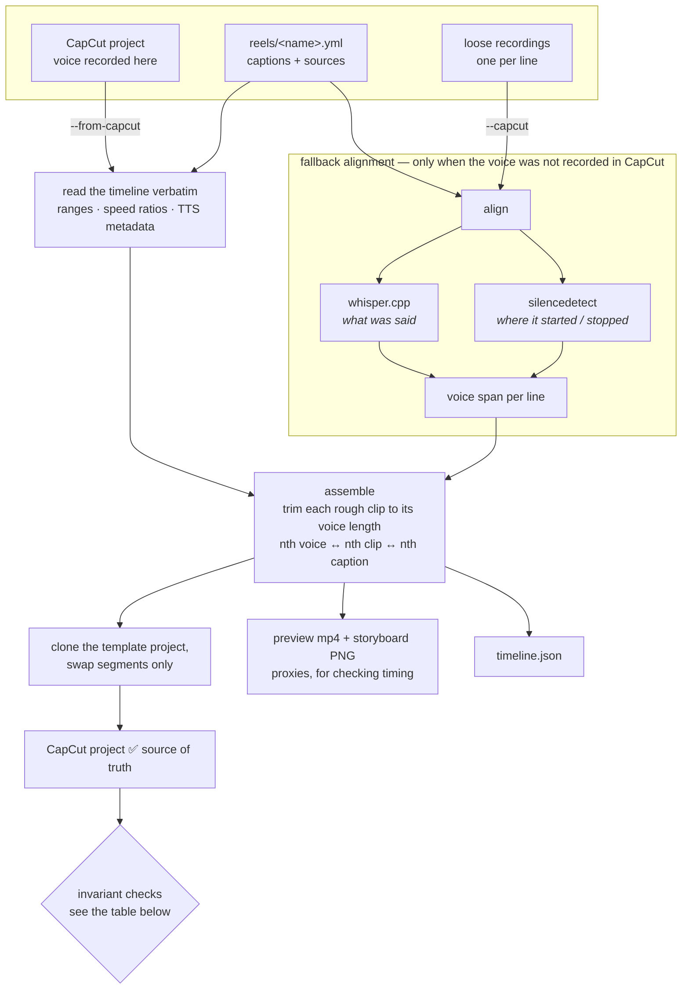

# broll

A reel assembler that fits between two CapCut sessions.

You record the voice in CapCut and drop in rough clips. broll lines the video and
captions up to the voice, then hands a real CapCut project back so you can add music
and export. 한국어: [README.ko.md](README.ko.md).

If you landed here looking for how CapCut stores its projects rather than for the tool,
[**docs/capcut-draft-format.md**](docs/capcut-draft-format.md) is a standalone write-up of
the format and the five things that break a writer.



> **Read the two entry paths, not the boxes.** `--from-capcut` *reads* timing that CapCut already
> committed to, so alignment error is zero by construction — that is the default and the one you want.
> `--capcut` *infers* timing, and only exists for voice recorded somewhere else.

## Why it works this way

**It never recreates your styling.** Fonts, sizes, strokes, shadows, positions and speed
ratios are copied from a template CapCut project, segment by segment. Trying to reproduce
them in code failed on every axis when measured against a real project. So **a format is
just a CapCut project** - to use a new one, build it once in CapCut and name it in
`template:`. There are no style values hard-coded anywhere.

## Usage

```bash
# Everything already in CapCut (voice, rough clips, captions)
uv run broll build --from-capcut 0812

# Captions and sources from a yml - broll init reads line count,
# durations and speed ratios straight from your recordings
uv run broll init 0812
uv run broll build reels/0812.yml --from-capcut 0812

# Recorded outside CapCut: give each line a `rec:` and let broll align it
uv run broll build reels/0812.yml --capcut 0812-out
```

The nth voice segment pairs with the nth rough clip and the nth caption. Mismatched counts
fail immediately rather than silently misaligning.

Outputs land in `reels/.broll/<name>/`: a CapCut project, a preview mp4, a storyboard PNG
with per-cut warnings drawn on it, and `timeline.json`.

## Design notes

**Timing is read, not guessed.** In `--from-capcut` mode the voice track is carried over
verbatim - source ranges, speed ratios, TTS voice metadata and all. Nothing is inferred,
so there is no alignment error to worry about.

**Alignment splits the problem across two signals** (only in the fallback mode).
whisper.cpp timestamps drift at the boundaries by 0.3-1.3s when measured, so *what was
said* comes from whisper and *where it started and stopped* comes from `silencedetect`.
Neither signal is trusted for the thing it is bad at.

**Captions are usually a paraphrase, not a transcript.** In a real reel, half the lines
did not match the spoken words closely. The span is only tightened from the text when the
match is strong and covers most of what was heard; otherwise the whole take is used.

**The preview is a proxy.** Burned-in captions approximate CapCut's text engine through
libass and will not match it exactly - colour emoji cannot be rendered at all and are
dropped from the preview only. The CapCut project is the source of truth for how captions
actually look.

## What the writer checks after every build

Each of these is a failure that actually happened:

| Invariant | Symptom when broken |
|---|---|
| Extra materials owned per segment | CapCut preview will not play |
| `draft_info.id` == `main_timeline_id` == `Timelines/<id>/` | Empty second tab, player stuck at 00:00:00:00 |
| Root and sub timeline documents in sync | CapCut opens stale content |
| Video track contiguous | Black frames between cuts |
| Caption style range counted in UTF-16 | Emoji lines render oversized and shift |
| Referenced media exists | Missing-media errors in CapCut |

## Requirements

macOS with CapCut 9.x.

```bash
brew install whisper-cpp ffmpeg-full   # the default ffmpeg bottle has no libass
curl -L --fail -o ~/.cache/broll/models/ggml-large-v3-turbo.bin \
  https://huggingface.co/ggerganov/whisper.cpp/resolve/main/ggml-large-v3-turbo.bin
```

whisper is only needed for the fallback alignment mode. `ffmpeg-full` is keg-only, so it
is not on `PATH`; broll finds it anyway (override with `BROLL_FFMPEG_DIR`).
